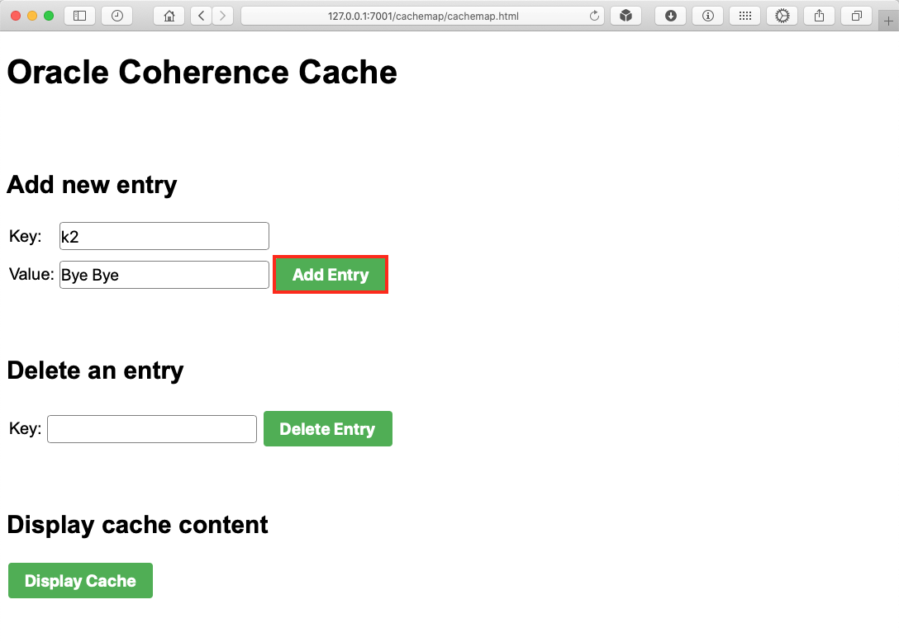
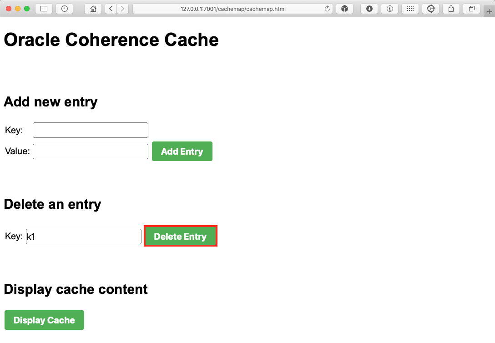

# Oracle Coherence Simple Demo Application #

## Overview ##

This project describes how to build and run a simple Coherence demonstration application. You can follow step-by-step instructions for building and running a basic Coherence application that demonstrates the fundamental Coherence concepts. And understand how to override the default configuration files when creating your own Coherence configurations.

The sample application uses simple JSP pages to demonstrate the ease of building a Coherence application. The source code is available in this repository and as a WAR file for. The only configuration change you need to make is the IP address of your cluster.

The steps below will not cover the deployment of the demo Web application to an application server. It is however, it has beeb tested on Oracle WebLogic Server.


## Prerequisites ##

### General Prerequisites ###
To run the demonstration application, you must have the following software installed:

1. Java 8 or 11 SE Development Kit or Runtime environment.

  You can download JDK 8 from:

  - [Java SE Development Kit](http://www.oracle.com/technetwork/java/javase/downloads/jdk8-downloads-2133151.html)
  - [Java SE Runtime Environment](http://www.oracle.com/technetwork/java/javase/downloads/jre8-downloads-2133155.html)

  You can download JDK 11 from:

    - [Java SE Development Kit 11 Downloads](https://www.oracle.com/technetwork/java/javase/downloads/jdk11-downloads-5066655.html)


2. Oracle Coherence 12.2.1.3.0 or later version installed. This demo application has been tested to run on 12.2.1.3.0.

  You can download it from https://www.oracle.com/middleware/technologies/coherence-archive-downloads.html.

3. An application sever such as WebLogic Server. This demo application has been tested to run on WebLogic Server 12.2.1.3.0.


### Environment Variables ###

Ensure the following environment variable is set in your configuration:


1. JAVA_HOME -- This variable must point to the location of the JDK version supported by the Oracle Coherence version that you use. Ensure that the path is set accordingly:

  For Linux/UNIX OS:
```
export PATH=$JAVA_HOME/bin:$PATH
```

2. COHERENCE_HOME -- This variable must point to the Coherence directory of your Coherence installation. This is required for starting the Coherence servers.

  For example:
```
export COHERENCE_HOME=/opt/Oracle/Middleware/Oracle_Home/Coherence
```

## Configure and Start a Cluster ##

### Prepare The Application ###

1. Download the demo application here:

  ```
  curl -LSs https://raw.githubusercontent.com/kwanwan/Coherence-Simple-Demo/master//cachemap.war
  ```

2. Unzip the `cachemap.war` into your working directory.

  ```
  jar -xvd cachemap.war
  ```

3. Change into the `classes` directory where `example-config.xml` and `tangosol-coherence-override.xml` are located.

  ```
  cd WEB-INF/classes
  ```


### Define a Cache ###

Caches are defined in a cache configuration deployment descriptor and are referred to by name within an application. The cache configuration file allows changes to be made to a cache without having to change an application's code. The following cache configuration defines a basic distributed cache which is mapped to the cache name '`demo`'.


The cache is defined in an XML file named `example-config.xml` and we have one defined for you already [example-config.xml](https://github.com/kwanwan/Coherence-Simple-Demo/src/main/webapp/WEB-INF/classes/example-config.xml):


```
<?xml version="1.0"?>

<cache-config xmlns:xsi="http://www.w3.org/2001/XMLSchema-instance"
   xmlns="http://xmlns.oracle.com/coherence/coherence-cache-config"
   xsi:schemaLocation="http://xmlns.oracle.com/coherence/coherence-cache-config
   coherence-cache-config.xsd">
   <caching-scheme-mapping>
      <cache-mapping>
         <cache-name>demo</cache-name>
         <scheme-name>distributed</scheme-name>
      </cache-mapping>
   </caching-scheme-mapping>

   <caching-schemes>
      <distributed-scheme>
         <scheme-name>distributed</scheme-name>
         <service-name>DistributedCache</service-name>
         <backing-map-scheme>
            <local-scheme/>
         </backing-map-scheme>
         <autostart>true</autostart>
      </distributed-scheme>
   </caching-schemes>
</cache-config>

```

Please take note of the tag `<cache-name>demo</cache-name>`. This is where the name of the cache is defined.


### Configure The Demo Cluster ###

Caches are hosted on a Coherence cluster. At run time, any JVM process that is running Coherence automatically joins the cluster and can access the caches and other services provided by the cluster. When a JVM joins the cluster, it is called a cluster node, or alternatively, a cluster member. For this demo application, two separate Java processes form the cluster: a cache server process and a replica process. For simplicity, the two processes are collocated on a single computer.

The cache server, by default, is configured to store cache data.
The demo cluster uses an operational override file to modify the out-of-box default cluster configuration. In particular, the default configuration is modified to create a private cluster which ensures that the two processes do not attempt to join an existing Coherence cluster that may be running on the network. The default configuration is also modified to load the `example-config.xml` cache configuration file instead of the default cache configuration file.

To configure and start the demo cluster you will need a `tangosol-coherence-override.xml` which we have defined one for you already. [tangosol-coherence-override.xml](https://github.com/kwanwan/Coherence-Simple-Demo/src/main/webapp/WEB-INF/classes/tangosol-coherence-override.xml).

```

<?xml version='1.0'?>

<coherence xmlns:xsi="http://www.w3.org/2001/XMLSchema-instance"
   xmlns="http://xmlns.oracle.com/coherence/coherence-operational-config"
   xsi:schemaLocation="http://xmlns.oracle.com/coherence/coherence-operational-config
   coherence-operational-config.xsd">
   <cluster-config>
      <member-identity>
         <cluster-name>demo</cluster-name>
      </member-identity>
      <multicast-listener>
         <address>address</address>
         <time-to-live>0</time-to-live>
      </multicast-listener>
   </cluster-config>

   <configurable-cache-factory-config>
      <init-params>
         <init-param>
            <param-type>java.lang.String</param-type>
            <param-value system-property="coherence.cacheconfig">
               example-config.xml</param-value>
         </init-param>
      </init-params>
   </configurable-cache-factory-config>
</coherence>

```

The cluster name is already defined as `demo`. Replace `address` with values that are unique for this cluster. For example, use a distinct IP address that is between 224.0.0.0 and 239.255.255.255:


Save the file to the same directory where the `example-config.xml` file was saved.


### Start The Coherence Cache Server ###

From a command prompt, start a cache server instance using the DefaultCacheServer class and include the location of the `coherence.jar` library and the configuration files as a Java -cp option.

For example:

```
java -cp "$COHERENCE_HOME/lib/coherence.jar:." com.tangosol.net.DefaultCacheServer

```

You should have an output something similar to below.

```
$ java -cp "$COHERENCE_HOME/lib/coherence.jar:." com.tangosol.net.DefaultCacheServer
2020-03-12 10:49:50.751/1.079 Oracle Coherence 12.2.1.4.0 <Info> (thread=main, member=n/a): Loaded operational configuration from "jar:file:/Users/Kwan/opt/oracle/wls214/coherence/lib/coherence.jar!/tangosol-coherence.xml"

...

2020-03-12 10:49:56.314/6.641 Oracle Coherence GE 12.2.1.4.0 <Info> (thread=main, member=n/a): Started cluster Name=demo, ClusterPort=7574

...

Started DefaultCacheServer...

2020-03-12 10:49:56.919/7.246 Oracle Coherence GE 12.2.1.4.0 <Info> (thread=DistributedCache, member=1): This member has become the distribution coordinator for MemberSet(Size=1
  Member(Id=1, Timestamp=2020-03-12 10:49:52.858, Address=192.168.0.3:55096, MachineId=62806, Location=process:80740, Role=CoherenceServer)
  )
2020-03-12 10:49:56.995/7.322 Oracle Coherence GE 12.2.1.4.0 <Info> (thread=DistributedCache, member=1): Partition ownership has stabilized with 1 nodes

```
Please take note of the `Started cluster Name=demo`. This is the cluster name defined in `tangosol-coherence-override.xml`.

Also take note of the membership of the cluster as being the first member `member=1`.


### Verify The Demo Cache ###

The cache server in this example is configured, by default, to store the cache's data. The data is available to all members of the cluster and persists even after members leave the cluster. For example, any updates we've made to the cache are still available for all cluster members as the cache is replicated to all cluster members.

We can verify the cache by using the cache factory command-line tool to connect to the demo cache and to add or list all items in the cache. It demonstrates both the persistent and distributed nature of Coherence caches.

To verify the cache:

1.  From a command prompt, start a standalone cache factory instance using the CacheFactory class and include the location of the `coherence.jar` library and the configuration files as a Java `-cp` option.

  For example:

  ```
  java -cp "$COHERENCE_HOME/lib/coherence.jar:." -Dcoherence.distributed.localstorage=false com.tangosol.net.CacheFactory

  ```

  The cache factory instance starts and becomes a member of the cluster and returns a command prompt for the command-line tool similar to below.

  ```
  2020-03-12 11:40:27.237/3.161 Oracle Coherence GE 12.2.1.4.0 <Info> (thread=Invocation:Management, member=2): Service Management joined the cluster with senior service member 1
  2020-03-12 11:40:27.276/3.200 Oracle Coherence GE 12.2.1.4.0 <Info> (thread=main, member=2): Loaded Reporter configuration from "jar:file:/Users/Kwan/opt/oracle/wls214/coherence/lib/coherence.jar!/reports/report-group.xml"

  Map (?):

  ```

  Please take note of the cluster joining as `member=2`.


2. At the command-line tool command prompt, get the `demo` cache using the cache command:

  ```
  cache demo
  ```

  You cache view should be in demo as below:

  ```
  Map (demo):
  ```

3. At the command-line tool command prompt, retrieve the contents of the cache using the list command.

  ```
  list
  ```

  The command returns null as there is nothing in the cache yet.

  Let's load an entry into the cache using the `put` command with first parameter as the key and the value as the second parameter.

  ```
  Map (demo): put k1 "Hello World!"
  null
  ```

4. Now, retrieve the contents of the cache again using the list command.

  ```
  Map (demo): list
  k1 = Hello World!
  ```

#### We now have a working Coherence cache with two members in a cluster. ####


## Deploying and Run The Demo Web Application ##

The demo application is a simple Web app that is written as a number of JSPs. There are JSPs to upload new entries to the cache as key value pairs, delete an entry and also display the entries in the cache.

When a JSP is loaded, it will instantiate a Coherence session and joins the running `demo` cluster as member 3. It will use the `example-config.xml` and `tangosol-coherence-override.xml` configuration packaged in the WAR file. However, the cache name is hardcoded in the JSP when getting a session to the demo cache with `getCache("demo");`.


### Prepare The Web Application WAR File ###

With the Coherence cache verified, we can now repackage the WAR file with the changes you made to `example-config.xml` and `tangosol-coherence-override.xml`.

1. Go to your webapp working directory and run the following to create a new WAR file:

  ```
  jar cvf cachemap.war *
  ```

2. Verify the content of your WAR by running the following:

  ```
  jar cvt cachemap.war
  ```

  and you have something similar to below:

  ```
  $ jar tvf cachemap.war
       0 Mon Mar 09 12:27:24 HKT 2020 META-INF/
      69 Mon Mar 09 12:27:24 HKT 2020 META-INF/MANIFEST.MF
       0 Thu Mar 05 13:36:46 HKT 2020 WEB-INF/
       0 Fri Mar 06 09:31:46 HKT 2020 WEB-INF/classes/
     804 Mon Mar 09 12:09:46 HKT 2020 WEB-INF/classes/example-config.xml
     885 Thu Mar 05 20:55:30 HKT 2020 WEB-INF/classes/tangosol-coherence-override.xml
       0 Thu Mar 05 13:36:48 HKT 2020 WEB-INF/lib/
  13490976 Thu Sep 12 01:12:34 HKT 2019 WEB-INF/lib/coherence.jar
      39 Thu Mar 05 13:33:52 HKT 2020 WEB-INF/web.xml
    2173 Mon Mar 09 12:26:20 HKT 2020 addentry.jsp
    2665 Mon Mar 09 12:27:08 HKT 2020 cachemap.html
    2187 Mon Mar 09 12:23:02 HKT 2020 deleteentry.jsp
    1985 Mon Mar 09 12:22:50 HKT 2020 displaycache.jsp

  ```

### Deploying and Running The Demo Application ###

To deploy and run the demo application example:

1. Deploy the `cachemap.war` file to a JavaEE server. We used WebLogic Server for this.

2. From a browser, run the Cache Map application by accessing the `cachemap.html` file using the following URL. Substitute host and port with values specific to the deployment.

  ```
  http://host:port/cachemap/cachemap.jsp

  ```

  The Cache Map application starts. A cache factory instance is created in the JSPs and becomes a member of the cluster when loaded. You should see a page similar to below once loaded:

  

In this simple application you can upload new entries to the cache as key value pairs. Delete an entry and also display the entries in the cache.

3. Display the cache by clicking on **Display Cache**. You should see the entry you previously added to the cache through the command-tool tool. This invokes the Coherence **get()** API to retrieve the entries.

  

  Click **Return**

  When the JSP is loaded, it will instantiate a Coherence session and joins the running `demo` cluster as member 3. You should see output in the first cache server instance you started using the **DefaultCacheServer** class similar to below:

  ```
  2020-03-12 12:22:12.176/187.109 Oracle Coherence GE 12.2.1.3.0 <D5> (thread=Invocation:Management, member=3): Service Management joined the cluster with senior service member 1

  ```

4. Try uploading a new entry by entering the key value pair and then click on **Add Entry**. This invokes the Coherence **put()** API to upload the entry.

  

  The cache content will be displayed after a successful upload.

  

  Click **Return**

5. Now try deleting a existing entry by entering the key of an existing entry and then click on **Delete Entry**. This invokes the Coherence **remove()** API to delete an entry.

  

  Again, if successful, the cache content will be refreshed.

  


### Verify The Demo Cache ###

We can verify the new entries uploaded by the demo Web application are accessible by other members of the cluster with the cache factory command-line tool.

The data in the cache is available to all members of the cluster and persists even after members leave the cluster. For example, the demo Web application exits after it loads and displays a key in the cache. However, the cache and key are still available for all cluster members.

We can use the cache factory command-line tool to connect to the `demo` cache to list all items in the cache. It demonstrates both the persistent and distributed nature of Coherence caches.

To verify the cache:

1. Go to the terminal of your cache factory command-line tool. You should still have this opened.

2. At the command-line tool command prompt, retrieve the contents of the cache using the list command.

```
list
```

3. The content of the cache should be the same as display in the Web demo application.

```
Map (demo): list
k2 = Bye Bye
```

## Congratulation - You have successful completed the demo !! ##
